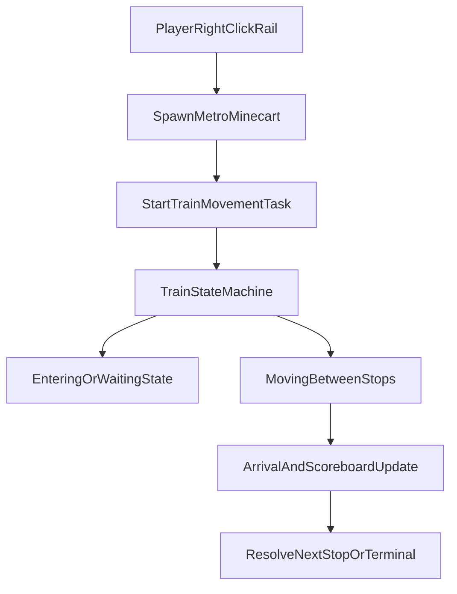

# Metro Architecture

## High-level Components

- `Metro` plugin bootstrap: lifecycle, manager wiring, command/listener registration.
- Managers:
  - `LineManager`: line persistence and stop-to-line index.
  - `StopManager`: stop persistence and world-based stop index.
  - `LanguageManager`: i18n message loading and fallback.
  - `SelectionManager`: player corner selections.
- Runtime:
  - `TrainMovementTask`: train state machine and ride lifecycle.
  - `ScoreboardManager`: ride-time visual status.
- Interaction:
  - Command entry: Cloud annotation commands in `command.newcmd`.
  - Main command groups: `MetroMainCommand`, `LineCommand`, `StopCommand`, `PortalCommand`.
  - Listeners: `PlayerInteractListener`, `PlayerMoveListener`, `VehicleListener`, `GuiListener`.

## Configuration Access

- `ConfigFacade` centralizes reads from `config.yml`.
- `Metro` exposes compatibility methods and delegates to `ConfigFacade`.
- New config keys should be added in `ConfigFacade` first.

## Persistence Model

- Lines are stored in `lines.yml`.
- Stops are stored in `stops.yml`.
- Managers load from YAML at startup and on `/m reload`.
- Invalid entries are handled defensively with warning logs where applicable.

## Runtime Flow

## Scheduler Policy

Metro supports Paper/Bukkit and Folia through `SchedulerUtil`. Folia APIs are reached by reflection so the plugin can still compile against the Spigot API.

- Global tasks are for plugin-level work that does not touch a specific entity or region, such as autosave coordination and delayed map refresh requests.
- Entity tasks are required when reading or mutating a player, minecart, or other entity. Ride display updates, countdowns, and minecart session tasks should stay on the entity scheduler.
- Region tasks are required when reading or mutating world or block state at a specific location. Spawning minecarts, portal destination work, and rail/block checks should be scheduled by location.
- Async tasks are only for file I/O, serialization work on already-created snapshots, or other non-Bukkit work. Async code must not access Bukkit worlds, entities, blocks, inventories, or player state.
- `SchedulerUtil` logs one warning when Folia reflection fails and it must fall back to Bukkit scheduling. That fallback keeps Paper/Bukkit compatibility but is not considered fully Folia-safe.

Shutdown cleanup: `Metro.onDisable()` clears online player displays and asks `TrainMovementTask` to remove active Metro trains tracked by the current runtime registry. Paper/Bukkit performs active train cleanup immediately and then runs a fallback world scan to remove old Metro minecart leftovers. Folia schedules active train cleanup on each minecart's entity scheduler and skips the fallback world scan because full world entity scans are not region-owned.

## Quality Gates

- Unit tests: Maven Surefire.
- Coverage gate: JaCoCo bundle line coverage threshold.
- Static analysis: SpotBugs check bound to `verify`.
